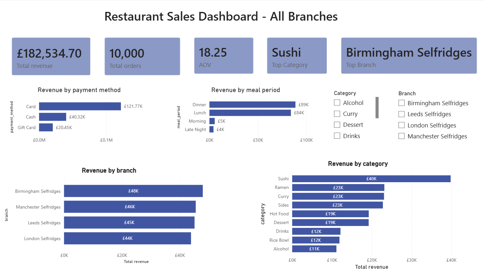
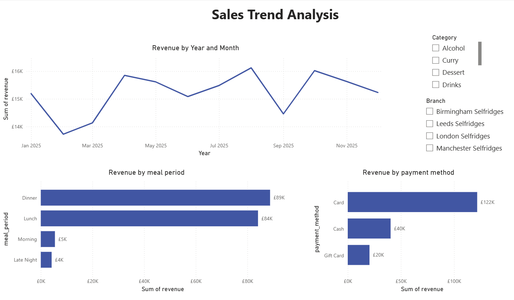

# 🍣 Restaurant Sales Analysis — Yo! Sushi UK (2024)

An end-to-end sales analytics project analysing transactional data across four UK Yo! Sushi branches.The project covers Python-based exploratory data analysis (EDA), SQL business analysis, Excel reporting, and an interactive Power BI dashboard.

---

## 📊 Project Overview

| Metric                    | Value                                            |
| ------------------------- | ------------------------------------------------ |
| Total Revenue             | £182,534.70                                      |
| Total Orders              | 10,000                                           |
| Average Order Value (AOV) | £18.25                                           |
| Top Branch                | Birmingham Selfridges                            |
| Top Category              | Sushi                                            |
| Date Range                | 2024 (full year)                                 |
| Branches                  | Birmingham, Manchester, Leeds, London Selfridges |

---

## 🔄 Analytics Workflow

Raw CSV Data
↓
Python (EDA & Validation)
↓
SQL (Business Analysis)
↓
Excel Dashboard
↓
Power BI Dashboard
↓
Business Recommendations

---

## Key Results

- Analysed 10,000 restaurant transactions across 4 UK branches
- Identified Birmingham Selfridges as top-performing branch (£48k revenue)
- Found Sushi generated the highest category revenue (£40k)
- Determined Dinner and Lunch periods drive over 90% of sales
- Built interactive Power BI dashboard with dynamic DAX measures and filters

---

## 🐍 Python Analysis

Python was used for exploratory data analysis (EDA) and data validation using Pandas and Matplotlib.

Activities included:

- Loading and inspecting transaction data
- Checking data quality and missing values
- Validating data types
- Analysing revenue by branch
- Analysing revenue by category
- Analysing revenue by payment method
- Analysing revenue by meal period
- Performing weekend vs weekday analysis
- Identifying top-performing products
- Creating supporting visualisations

---

## 🗂️ Repository Structure

```
restaurant-sales-analysis/
│
├── data/
│   ├── sales_transactions.csv      # Raw transactional data
│   └── menu_reference.csv          # Item names, categories, prices
│
├── sql/
│   └── sql_queries.sql             # All SQL queries (aggregations + window functions)
│
├── notebooks/
│   ├── generate_sales_data.ipynb   # Synthetic data generation script
│   └── sales_analysis.ipynb        # Exploratory data analysis in Python
│
├── dashboard/
│   ├── Dashboard.pbix              # Power BI report file
│   └── Restaurant_Sales_Dashboard.xlsx  # Excel version of dashboard
│
└── README.md
```

---

## 🔍 Business Questions Answered

### 1. Which branch drives the most revenue?

Birmingham Selfridges leads with the highest total revenue, followed by Manchester, Leeds, and London. Birmingham's edge comes from both higher order volume and a slightly higher AOV — suggesting a busier or higher-spend customer base.

### 2. What time of day generates the most revenue?

Dinner and Lunch together account for the overwhelming majority of revenue (~90%+), while Morning and Late Night are minimal. This suggests little opportunity in off-peak hours and validates a focus on optimising the dinner service window.

### 3. Which categories and items are top performers?

Sushi dominates category revenue, followed by Ramen and Curry. This is consistent with the brand's core identity. Lower performers like Alcohol and Rice Bowl may represent upsell opportunities or candidates for menu review.

### 4. How do branches compare on order channel mix?

Using window functions, each branch's order channel breakdown (e.g. dine-in, delivery, takeaway) was calculated as a percentage of that branch's total orders — allowing like-for-like comparison across locations.

### 5. What does month-over-month revenue growth look like?

A `LAG()` window function was used to compute MoM revenue change across the year, identifying seasonal peaks and slower months for targeted planning.

---

## 🛠️ SQL Techniques Used

| Technique                         | Example Use Case                                          |
| --------------------------------- | --------------------------------------------------------- |
| `GROUP BY` + `SUM` / `COUNT`      | Revenue and order totals by branch, category, meal period |
| Subquery                          | Revenue percentage share across categories                |
| `SUM() OVER()`                    | Window-based percentage share (alternative to subquery)   |
| `ROW_NUMBER() OVER(PARTITION BY)` | Top 3 products/categories per branch                      |
| `RANK()` / `DENSE_RANK()`         | Branch ranking by revenue                                 |
| `SUM() OVER(ORDER BY)`            | Cumulative/running revenue by month                       |
| `LAG()`                           | Month-over-month revenue growth                           |
| CTE (`WITH`)                      | Multi-step ranked queries                                 |

---

## 📈 Key Insights

- **Birmingham Selfridges is the clear top performer** — highest revenue and AOV across all branches.
- **Sushi accounts for the largest share of revenue** across all locations, reinforcing it as the core product focus.
- **Dinner is the dominant meal period** — operations and staffing should be weighted accordingly.
- **Card payments dominate**, with Cash and Gift Card accounting for a smaller share — suggesting the business could benefit from incentivising gift card usage.
- **London Selfridges underperforms** relative to other branches despite being a high-footfall location — this may indicate a menu, pricing, or operational gap worth investigating.

---

## 🧰 Tools & Technologies

- PostgreSQL — SQL analysis and reporting
- Python (Pandas, NumPy, Matplotlib) — EDA and validation
- Excel — Pivot Tables, Pivot Charts and dashboarding
- Power BI — Interactive dashboards and DAX measures
- DAX — Dynamic KPIs and dashboard calculations
- DAX measures for Revenue
- DAX measures for Orders
- Average Order Value (AOV)
- Dynamic Top Branch calculation
- Dynamic Top Category calculation
- Interactive branch and category filtering

---

## 🎯 Skills Demonstrated

- Data Cleaning
- Exploratory Data Analysis
- SQL Querying
- Window Functions
- Business Intelligence
- Dashboard Development
- Power BI
- DAX
- KPI Design
- Data Visualisation
- Business Insight Generation

---

## 💡 What I Learned

- How to use window functions (`ROW_NUMBER`, `RANK`, `LAG`, `SUM OVER`) to answer ranked and time-series questions without multiple subqueries
- The difference between `RANK()` and `DENSE_RANK()` and when each is appropriate
- How to calculate percentage share using both a subquery and `SUM() OVER()` — and why the window function approach is cleaner
- How to structure a Power BI dashboard for a business audience: KPI cards first, then decomposition by dimension

---

## 📸 Dashboard Preview

### Executive Dashboard



### Trend Analysis



---

_Data is synthetic and generated for portfolio purposes only._
